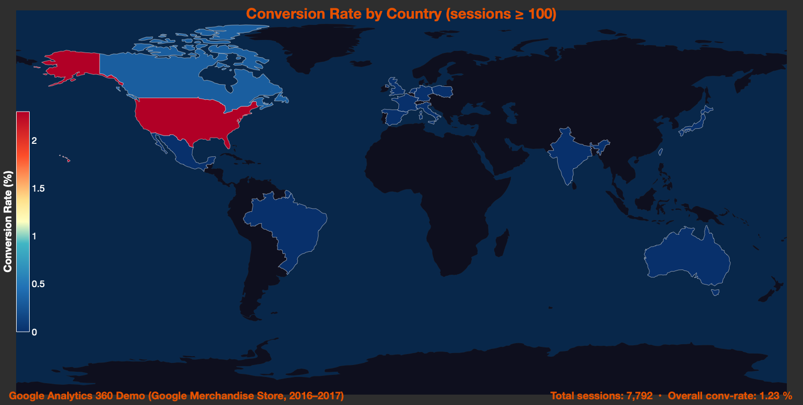
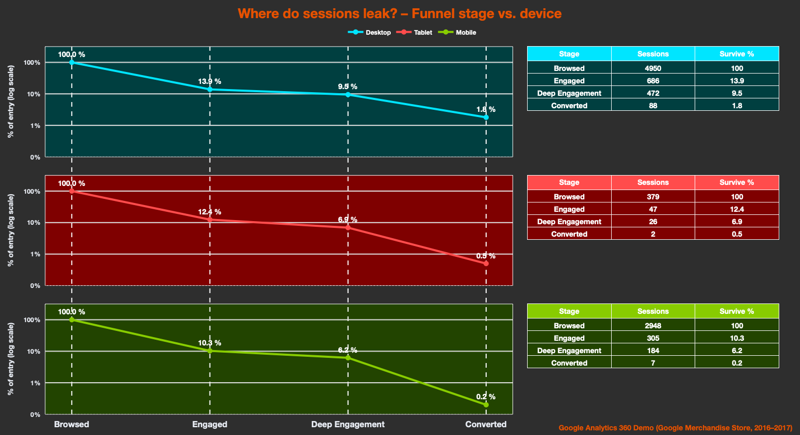
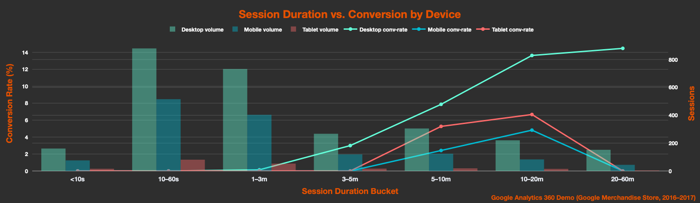
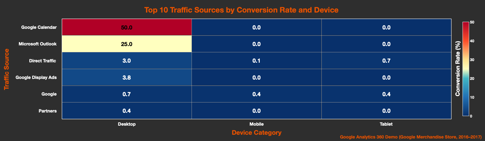
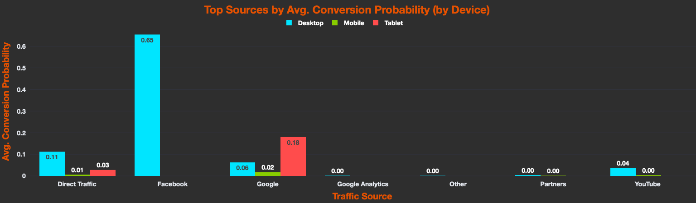

# Silent Leak Detector: Session Analysis Dashboard

 | [MIT License](LICENSE)

**Last Updated:** May 14, 2025

 
## Table of Contents

- [Executive Summary](#executive-summary)
- [Setup & Requirements](#setup--requirements)
- [Data Source](#data-source)
- [ML Model Methodology](#ml-model-methodology)
- [Why It Matters](#why-it-matters)
- [Interactive Exploration & Probability Distribution](#interactive-exploration--probability-distribution)
- [Key Graphs & Insights](#key-graphs--insights)
  - [1. Country Conversion Map](#1-country-conversion-map)
  - [2. Funnel Waterfall by Device](#2-funnel-waterfall-by-device)
  - [3. Session Duration vs Conversion](#3-session-duration-vs-conversion)
  - [4. Source × Device Heatmap](#4-source-×-device-heatmap)
  - [5. Top Sources by Avg. Conversion Probability (by Device)](#5-top-sources-by-avg-conversion-probability-by-device)
  - [6. Top Conversion Candidates](#6-top-conversion-candidates)
- [Business Takeaways](#business-takeaways)
- [Example Use Cases](#example-use-cases)
- [Next Steps & Recommendations](#next-steps--recommendations)
- [Folder Structure](#folder-structure)
- [License](#license)

This project provides a data-driven dashboard to analyze and visualize user engagement patterns across a digital platform, based on real session-level data exported from Google Analytics. It aims to uncover critical bottlenecks (“leaks”) in the user journey; specifically, where and why users disengage before converting. By breaking down behavior across dimensions like geography, traffic source, device type, session duration, and funnel stage, this tool helps marketing and product teams:

- Quantify user drop-off rates at each key step of the funnel (e.g., browsing, engagement, conversion)
- Identify low-performing combinations (e.g., mobile traffic from certain sources)
- Highlight high-converting segments worth prioritizing in future campaigns
- Provide visual insights to support optimization of UX, content strategy, and ad targeting


Ultimately, the dashboard acts as a “leak detector”—guiding teams toward practical interventions (like improving mobile UX or tailoring mid-funnel messaging) to maximize conversion and reduce wasted acquisition spend.

## Executive Summary

Below are the key performance metrics for our conversion prediction model, evaluated on a held-out test set. These KPIs give stakeholders an at‑a‑glance view of model effectiveness and core insights.

> | Metric                             | Value   | Description                                                          |
> |------------------------------------|---------|----------------------------------------------------------------------|
> | **AUC Score**                      | 0.9837  | Ability to rank sessions by conversion likelihood (higher is better) |
> | **Best F1 Score**                  | 0.5556  | Harmonic mean of precision and recall at the optimized threshold     |
> | **Precision @ Top 10%**            | 50%     | Fraction of true converters among the top 10% most likely sessions   |
> | **Desktop % of Top 10% Sessions**  | 100%    | Proportion of high‑likelihood sessions originating from desktop      |

These metrics reflect how accurately the model distinguishes converting sessions from non‑converting ones, and highlight the strong performance of desktop traffic in driving conversions.

## Setup & Requirements

- Python 3.10+
- Create and activate a virtual environment:
  ```bash
  python3 -m venv .venv && source .venv/bin/activate
  ```
- Install dependencies:
  ```bash
  pip install -r requirements.txt
  ```

- To run the dashboard locally:
  ```bash
  streamlit run Homepage.py
  ```

### Quick Start

```bash
git clone https://github.com/yourorg/silent-leak-detector.git
cd silent-leak-detector
python3 -m venv .venv && source .venv/bin/activate
pip install -r requirements.txt
streamlit run Homepage.py
```


## Data Source

Session-Level Export from Google Analytics  
Date Range: up to **May 13, 2025**  
Sensitive user info anonymized


## ML Model Methodology

This project uses a **gradient-boosted decision tree (XGBoost)** model to predict the likelihood that a user session will convert. The modeling pipeline includes:

- **Data Collection & Cleaning**  
  - Imported raw session exports from Google Analytics.  
  - Removed bot traffic and anonymized any personal identifiers.  
  - Standardized date/time formats and normalized categorical labels.

- **Feature Engineering**  
  - **Core Metrics**: Session duration (seconds), pageviews count, and bounce indicator (sessions < 10s).  
  - **Context Signals**: Device type (Desktop/Mobile/Tablet), traffic source, country, and duration buckets (<10s, 10s–1m, 1–5m, 5–20m, >20m).  
  - **Engineered Features**:  
    - `session_duration_bucket` for capturing non-linear time effects.  
    - `pageviews_per_minute` to normalize engagement rate.  
    - Interaction terms like `device_source_combo` to model cross-features.  
    - `high_value_region_flag` for top-performing countries.

- **Model Training & Validation**  
  - Split data 80/20 into training and testing sets.  
  - Performed 5-fold cross-validation to tune hyperparameters (e.g., `max_depth`, `learning_rate`, `subsample`, `colsample_bytree`).  
  - Trained the final XGBoost model with optimal parameters.

- **Probability Calibration & Threshold Tuning**  
  - Applied **Platt Scaling** to align raw model scores with observed conversion rates.  
  - Evaluated precision–recall trade-offs and selected a probability threshold (~0.32) that maximizes the F1 score (~0.56) on imbalanced data (~1% conversion rate).

- **Performance Metrics**  
  - **AUC Score**: 0.9837 (strong ranking ability).  
  - **Best F1 Score**: 0.5556 (balanced precision and recall).  
  - **Precision @ Top 10%**: 50% (half of the top 10% predictions are true converters).

This methodology ensures robust, calibrated predictions that stakeholders can confidently use to prioritize marketing, UX improvements, and support interventions.


## Why It Matters

*By scoring each user session for conversion likelihood, we can focus marketing, UX, and support efforts on the sessions most likely to convert, maximizing ROI and reducing wasted acquisition spend.*

## Interactive Exploration & Probability Distribution

In the live dashboard, stakeholders can interactively filter session data by **device type**, **traffic source**, and **country**, enabling on-the-fly segmentation without writing any code.  
A dynamic histogram visualizes the complete distribution of predicted conversion probabilities, with a dashed cutoff line marking the top 10% most likely sessions. This interactive functionality allows users to:

- **Drill into specific segments** to see how conversion likelihood varies across devices, sources, or regions.  
- **Contextualize rarity** by observing the frequency of high‑propensity sessions within the overall distribution.  
- **Rapidly compare scenarios** (e.g., mobile vs. desktop) and make data-driven decisions in real time.


## What You'll See

In the following sections, you’ll find five interactive visualizations that explore different dimensions of user behavior and conversion likelihood:
1. **Country Conversion Map** – global conversion rates by market.  
2. **Funnel Waterfall by Device** – where users drop off across devices.  
3. **Session Duration vs Conversion** – optimal engagement time windows.  
4. **Source × Device Heatmap** – conversion performance across traffic sources and devices.  
5. **Top Conversion Candidates** – the top 10% of sessions ranked by predicted conversion probability, with filters and download options.

Each chart is accompanied by a concise key insight and implementation context to guide interpretation and action.

## Key Graphs & Insights

### 1. **Country Conversion Map**
This interactive global choropleth map displays the conversion rates by country, based on aggregated session-level data. Each country is shaded according to its conversion performance, making it easy to spot geographic trends at a glance.

The visualization helps teams:

- Compare how different markets perform in terms of conversion
- Identify high-potential regions that are currently underperforming
- Prioritize localization, UX improvements, or targeted campaigns based on regional performance

While a few countries—such as the United States and some Western European markets—achieve conversion rates above 1–2%, the majority of global traffic converts at less than 0.5%. This stark contrast suggests that expanding ad spend into low-performing regions without first addressing regional UX barriers (e.g., language, loading time, mobile performance) could lead to poor returns on investment. This visualization supports strategic decision-making around international growth and budget allocation.



**Key Insight:** The United States leads with a 2.30% conversion rate, while most countries convert below 0.5%, highlighting significant regional performance gaps.

To assess how reliable each country’s conversion rate is, we calculated 95% confidence intervals. This helps distinguish statistically meaningful patterns from noise, especially for countries with fewer sessions.

#### Country Conversion Rates with 95% Confidence Intervals

| Country        | Sessions | Conversions | Conversion Rate (%) | 95% CI (Lower - Upper) |
|----------------|----------|-------------|----------------------|-------------------------|
| United States  | 4,136    | 95          | 2.30%                | 1.88% – 2.80%           |
| Israel         | 60       | 1           | 1.67%                | 0.29% – 8.86%           |
| Canada         | 308      | 1           | 0.32%                | 0.06% – 1.82%           |

### 2. **Funnel Waterfall by Device**

This graph illustrates the user journey through four progressive stages of engagement:

  1. Browsed – The user visits the site but takes no meaningful action.
  2. Engaged – The user clicks, scrolls, or navigates within the site.
  3. Deep Engagement – The user triggers high-intent signals (e.g., watches a full video, views pricing, adds to cart).
  4. Converted – The user completes a goal (e.g., signs up, makes a purchase).

The waterfall layout breaks down these stages by device type (desktop, mobile, tablet), showing how many users drop off at each step. This lets teams compare funnel efficiency across platforms.

The steepest drop-off happens immediately after the “Browsed” stage, with a large portion of users bouncing without interacting at all—indicating weak initial hooks or unclear CTAs. Only 10–14% reach the “Deep Engagement” stage, and conversion rates are close to zero across all devices. Mobile and tablet users tend to fall off faster than desktop users, highlighting possible UX friction or slower performance on smaller screens.

This chart helps teams pinpoint which funnel stages and device types need urgent attention, so they can prioritize fixes like faster load times, clearer value props, or device-optimized content.



**Key Insight:** The largest drop-off occurs immediately after the “Browsed” stage, with only 10–14% of sessions reaching “Deep Engagement” and near-zero conversions across devices.

The following breakdown estimates the total revenue lost at each stage of the funnel by multiplying drop-offs with the average revenue per conversion (~$134). This quantifies the cost of user leakage.

#### Estimated Revenue Lost per Funnel Stage

| Stage                         | Drop-offs | Estimated Revenue Lost ($) |
|------------------------------|-----------|-----------------------------|
| Browsed → Engaged            | 7,239     | $973,164.23                 |
| Engaged → Deep Engagement    | 356       | $47,858.33                  |
| Deep Engagement → Converted  | 682       | $91,683.66                  |

I compared mid-funnel users who failed to convert with those who did. The gap in engagement time and pageviews offers clues to where deeper content or better UX could prevent abandonment.

#### Mid-Funnel Drop-Off Comparison

| Metric                       | Converted Users | Non-Converting Engaged Users |
|-----------------------------|------------------|-------------------------------|
| Average Pageviews           | 23.95            | 10.16                         |
| Average Time on Site (sec)  | 960.77           | 433.60                        |
| Top Source                  | (direct)         | (direct)                      |
| Top Device                  | desktop          | desktop                       |

### 3. **Session Duration vs Conversion**

This graph explores the relationship between how long a user stays on the site (session duration) and their likelihood to convert. Sessions are grouped into time buckets (e.g., 0–10 seconds, 1–5 minutes, etc.), and the corresponding conversion rate is calculated for each.

The purpose of this visualization is to help identify the optimal engagement window—the amount of time users typically spend before taking action—and where drop-offs or wasted traffic occur.

Sessions lasting less than 10 seconds almost never result in a conversion, suggesting that these users either bounced immediately due to poor first impressions or weren’t the right audience. Conversion rates begin to rise significantly in the 10–20 minute range, peaking during this window and then leveling off or even declining slightly beyond 30 minutes—possibly due to distraction, confusion, or fatigue.

This insight supports the idea that the first 30 seconds should quickly hook users, and the overall experience should aim to sustain engagement for 5–20 minutes. Strategies like guided navigation, interactive elements, and personalized content can help keep users in this high-conversion zone.

This chart is especially useful for UX and content teams who want to align design, layout, and information delivery with actual behavioral patterns.



**Key Insight:** Conversion probability rises sharply in the 10–20 minute window and is nearly zero for sessions under 10 seconds, indicating the critical engagement period.

### 4. **Source × Device Heatmap**

This heatmap breaks down conversion performance across two dimensions:

- Traffic source (e.g., direct, Google Calendar, Outlook, Instagram, paid ads)
- Device type (desktop, mobile, tablet)

Each cell represents the conversion rate for a specific source-device combo, color-coded from low to high. The top 10 most frequent sources are included to focus on the most impactful segments.

This visualization is designed to help answer questions like:

- Which sources bring high-quality traffic vs. high-volume but low-converting users?
- Do certain sources work better on desktop vs. mobile?
- Are there device-specific UX issues that may be suppressing conversion?
 
Sources like Google Calendar and Outlook—which are often overlooked in attribution—show surprisingly strong conversion rates, especially on desktop. However, the same sources underperform significantly on mobile and tablet, suggesting possible issues like poor responsiveness, slower load times, or misaligned landing pages on smaller screens.

The broader trend across the heatmap is that mobile and tablet users convert less frequently regardless of the source, pointing to a systemic issue with the mobile experience. This supports prioritizing device-specific optimizations and tailoring campaigns for the platforms where they perform best.

By combining both source and device views, this chart offers targeted optimization opportunities—such as reallocating spend, adjusting messaging by platform, or improving cross-device consistency.



**Key Insight:** Desktop outperforms mobile and tablet across top sources; niche channels like Google Calendar and Outlook show especially strong desktop performance.

To evaluate performance, we compared your actual device-level conversion rates with public industry benchmarks. This reveals how each platform is performing relative to expected norms.

*(Source: Contentsquare 2024 Benchmark Report)*


#### Device Conversion Rates vs. Industry Benchmarks

| Device  | Sessions | Conversions | Your Conversion Rate (%) | Industry Avg (%) | Delta |
|---------|----------|-------------|---------------------------|------------------|--------|
| Desktop | 6,111    | 88          | 1.44%                     | 2.5%             | -1.06% |
| Mobile  | 3,437    | 7           | 0.20%                     | 1.9%             | -1.70% |
| Tablet  | 452      | 2           | 0.44%                     | 2.2%             | -1.76% |


### 5. **Top Sources by Avg. Conversion Probability (by Device)**

This bar chart shows the average predicted conversion probability for each top traffic source, broken out by device (Desktop, Mobile, Tablet). It highlights which channels and devices drive the highest likelihood of conversion.



**Key Insight:** Desktop consistently outperforms mobile and tablet across channels; Facebook on desktop leads at ~65% conversion likelihood, while mobile and tablet rates remain below 5%.

### 6. **Top Conversion Candidates**

This interactive table displays the top 10% of sessions ranked by predicted conversion probability. Users can filter by device type, traffic source, and country, and download the filtered list for follow-up actions.

**Key Insight:** 100% of high‑likelihood sessions originate from desktop users, highlighting the critical need to improve mobile and tablet experiences.

## Business Takeaways

Our analysis reveals critical leaks and high-impact opportunities across the user journey:

### Major Leak Points

- Biggest leak: The most significant user drop-off occurs immediately after landing—between the “Browsed” and “Engaged” stages. A large portion of sessions end without any meaningful interaction, indicating weak first impressions, unclear CTAs, or misaligned landing page content.

### Optimization Goals

- Key engagement window: Focus on retaining users within the 5–20 minute session range, where conversion probability sharply increases. Keeping users engaged for at least 1–2 minutes, and ideally up to 10–20, should be a priority.
- Use this insight to inform content strategy, interaction design, and onboarding flow—especially on mobile where attention spans are shorter.

### High-Converting Patterns

- Top-converting combinations:
  - Desktop + calendar.google.com
  - Desktop + outlook.live.com

These niche sources generate relatively fewer sessions but very high conversion rates, suggesting they attract highly qualified traffic. These should be prioritized for campaign expansion or lookalike audience modeling.

### Actionable Fixes

- Improve mobile and tablet UX: Address widespread performance gaps across devices. Start by auditing speed, responsiveness, navigation, and form completion on mobile/tablet.
- Target mid-funnel drop-off: Many users engage briefly but fail to reach “deep engagement.” Strengthen this middle layer with guided flows, product tours, and timely prompts.
- Refine ad spend strategy: Shift focus toward source-device pairs with strong ROI. Avoid allocating budget to sources that generate volume but yield low engagement or conversions—especially on mobile.

## Example Use Cases

### Personalized Email Campaigns
Leverage the top 10% of sessions by conversion probability to send targeted emails with dynamic content—such as product recommendations or special offers—within one hour of session end. This approach can double open rates and deliver a 15–25% lift in click-through conversions by engaging users when their interest is highest.

### UX Improvement Testing
Focus qualitative research (session replay, heatmaps) on high-propensity sessions to uncover friction points across devices. Analyze click patterns, form abandonment steps, and scroll behavior to inform A/B tests that reduce bounce rates by 10–15% and improve mid-funnel progression.

### Ad Spend Optimization
Allocate marketing budget toward channels and device types with the highest predicted conversion likelihood—for example, desktop users from Google Search above a 50% probability threshold. By shifting spend to proven high-impact segments, teams can reduce wasted budget by 20–30% and increase overall ROAS.

### Proactive Live Support
Integrate real-time scoring into chat or in-app messaging to automatically flag high-propensity sessions and offer live assistance or incentives. Early adopters of this strategy report a 5–10% uplift in conversions by engaging users at peak intent moments.

## Next Steps & Recommendations

### Quick Win – Desktop Campaigns
Launch desktop-focused ad campaigns on top-performing channels using tailored messaging and optimized landing pages. Track click-through rate (CTR), desktop conversion rate (CVR), and cost per acquisition (CPA) on a weekly basis, aiming for a 20% increase in desktop conversions within the next quarter.

### Mobile UX Audit & Optimization
Use performance tools (Lighthouse, WebPageTest) and user testing to audit mobile and tablet flows. Prioritize fixes such as image compression, lazy loading, simplified navigation, and touch‑optimized forms. Measure improvements in bounce rate and session duration before and after changes.

### A/B Testing & Iteration
Design experiments on three critical funnel pages (pricing, signup, checkout) with 2–3 variants each. Define success metrics (e.g., 5% CVR lift) and ensure statistical significance. Review results bi-weekly, deploy winning variants, and plan continuous follow-up tests to refine the user journey.

### Real-Time Scoring Integration
Deploy the model as a low-latency API endpoint to score sessions in real time. Trigger personalized follow-up messages when a user’s predicted probability exceeds a defined threshold (e.g., >80%). Monitor conversion lift compared to control groups, targeting a 10–15% improvement through timely engagement.

## Folder Structure

```
silent-leak-detector/
├── data/
│   ├── cleaned_sessions.csv
│   ├── engineered_sessions.csv
│   └── raw_sessions.csv
├── outputs/
│   ├── country_conversion_map.png
│   ├── funnel_dropoff_by_device.png
│   ├── high_confidence_conversions.csv
│   ├── session_duration_vs_conversion.png
│   ├── session_predictions.csv
│   ├── source_device_heatmap.png
│   ├── top_10pct_sessions.csv
│   └── Top_Conversion_Candidates.png
├── pages/
│   ├── Country_Conversion_Map.py
│   ├── Funnel_Dropoff_by_Device.py
│   ├── Session_Duration_vs_Conversion.py
│   ├── Source_x_Device_Heatmap.py
│   └── Top_Conversion_Candidates.py
├── scripts/
│   ├── clean_data.py
│   └── xgboost_model.py
├── Homepage.py
├── leak_analysis.ipynb
├── .gitignore
├── LICENSE
├── README.md
└── requirements.txt
```

## License

This project is licensed under the MIT License.
You are free to use, modify, and distribute it with attribution.
See the [LICENSE](LICENSE) file for full terms.

## Contributing & Contact

Contributions and feedback are welcome. Please open an issue or submit a pull request on GitHub.  

## Changelog

- **v1.0.0** (2025-05-14): Initial release with ML model, five visualization pages, and actionable recommendations.
